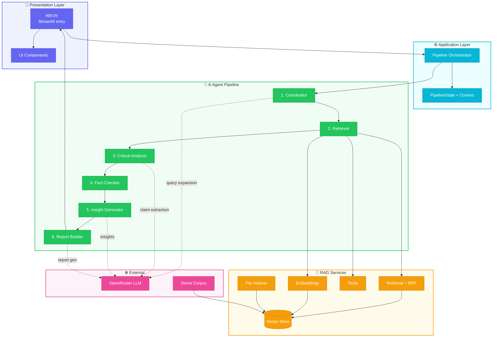
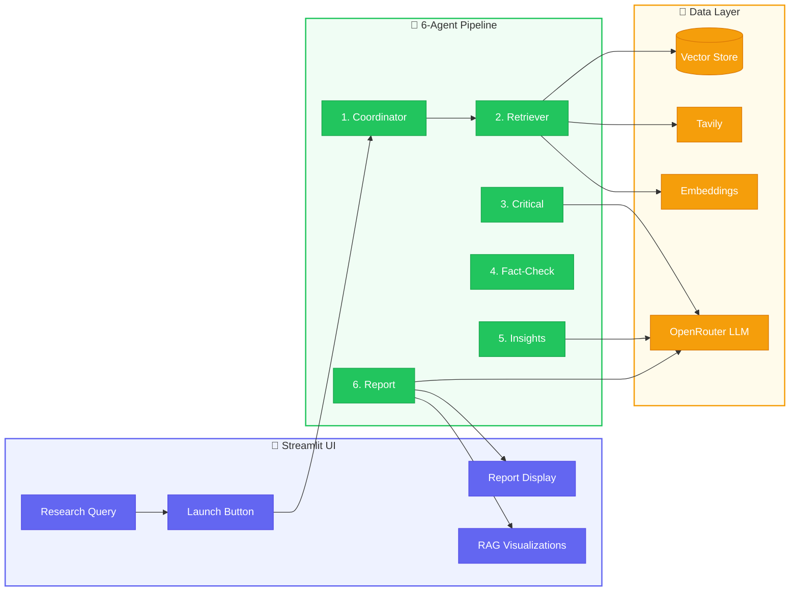

# Astraeus 2.0 — Multi-Agent AI Deep Researcher

6 Agents · RAG-Powered · Autonomous Research Pipeline

---

## Project Overview

**Astraeus 2.0** is a Streamlit-based multi-agent research application that runs a 6-agent RAG pipeline. A user enters a research query; the system expands it into multiple search queries, retrieves from a vector DB and optional web search (Tavily), extracts claims, fact-checks them, generates insights, and produces a final report with citations.

- **What it does:** Autonomous research pipeline that answers queries using RAG (Retrieval-Augmented Generation)
- **Tagline:** 6 Agents · RAG-Powered · Autonomous Research Pipeline
- **Tech stack:** Python, Streamlit, sentence-transformers (local embeddings), OpenRouter (LLM), optional Tavily (web search)
- **Vector store:** Lightweight NumPy-based implementation (no ChromaDB dependency) — stores embeddings in `./data/chroma_db/` as JSON + `.npy` files

---

## Architecture

### High-Level Design



### Data Flow (Simplified)



---

## Pipeline Flow (6 Agents)

| Order | Agent | Role | Key Outputs |
|-------|-------|------|-------------|
| 1 | **Research Coordinator** | Query analysis, multi-query expansion | `expanded_queries`, `query_analysis`, `routing_hint` |
| 2 | **Contextual Retriever** | Vector search + optional Tavily web search | `retrieved_chunks`, `web_results`, `retrieval_metadata` |
| 3 | **Critical Analysis** | Claim extraction, contradiction detection, evidence chains | `claims`, `contradictions`, `evidence_chains` |
| 4 | **Fact-Checker** | Source credibility, cross-check claims | `fact_check_results`, `credibility_summary` |
| 5 | **Insight Generator** | Themes, gaps, hypotheses | `themes`, `gaps`, `hypotheses`, `key_insights` |
| 6 | **Report Builder** | Assemble final markdown report with citations | `report_markdown`, `report_metadata` |

Context flows via a shared `context` dict passed between agents. Orchestration: [pipeline/orchestrator.py](pipeline/orchestrator.py).

---

## Project Structure

```
├── app.py                 # Streamlit entry point
├── config.py              # Env-based configuration
├── requirements.txt       # Python dependencies
├── .env.example           # Env template (copy to .env)
├── agents/                # 6 agent modules
│   ├── coordinator.py     # Query expansion
│   ├── retriever.py       # Vector + web search
│   ├── critical_analysis.py
│   ├── fact_checker.py
│   ├── insight_generator.py
│   └── report_builder.py
├── pipeline/
│   └── orchestrator.py    # Sequential 6-agent run
├── rag/
│   ├── vector_store.py    # NumPy-based vector DB
│   ├── embeddings.py      # sentence-transformers
│   ├── retrieval.py       # Multi-query + RRF re-ranking
│   └── web_search.py      # Tavily client
├── llm/
│   └── openrouter_client.py
├── utils/
│   └── pdf_export.py     # Markdown → PDF export
├── ui/
│   ├── components.py      # Agent cards, progress bar
│   ├── styles.py          # Custom CSS
│   ├── embedding_viewer.py
│   ├── retrieval_waterfall.py
│   └── source_or_claims.py
└── data/
    └── demo_corpus.py     # 15 sample AI/RAG docs
```

---

## Setup Instructions

**Prerequisites:** Python 3.9+, ~500MB disk for sentence-transformers model

**Steps:**

1. Clone the repo and `cd` into it
2. Create virtual environment: `python -m venv venv && source venv/bin/activate` (Windows: `venv\Scripts\activate`)
3. Install dependencies: `pip install -r requirements.txt`
4. Copy env template: `cp .env.example .env`
5. Edit `.env` with your keys:
   - **Required for full LLM features:** `OPENROUTER_API_KEY` (get from [openrouter.ai](https://openrouter.ai))
   - **Optional:** `TAVILY_API_KEY` (for web search; get from [tavily.com](https://tavily.com))
6. Run: `streamlit run app.py`

**React frontend + FastAPI API:** To run the API server (for the React UI), use port **8765** so the frontend can reach it and to avoid conflicts with other tools:  
`uvicorn server.api:app --reload --port 8765`  
Then run the frontend: `cd frontend && npm run dev`. The frontend expects the API at `http://localhost:8765` by default.

---

## Configuration Reference

From [config.py](config.py) and [.env.example](.env.example):

| Variable | Default | Description |
|----------|---------|-------------|
| `OPENROUTER_API_KEY` | — | OpenRouter API key (GPT-4, Claude, etc.) |
| `TAVILY_API_KEY` | — | Optional Tavily web search key |
| `LLM_MODEL` | `openai/gpt-4o-mini` | OpenRouter model ID |
| `VECTOR_DB_PATH` | `./data/chroma_db` | Vector store persistence path |
| `EMBEDDING_MODEL` | `all-MiniLM-L6-v2` | sentence-transformers model |
| `TOP_K_RESULTS` | `10` | Max chunks retrieved per query |
| `MAX_QUERY_EXPANSIONS` | `3` | Number of query variants |
| `RERANK_ENABLED` | `true` | Enable RRF re-ranking |

---

## Demo Corpus

On first run, the app auto-loads 15 sample documents from [data/demo_corpus.py](data/demo_corpus.py) into the vector store (topics: RAG, LLMs, embeddings, fact-checking, etc.). To re-index manually: `python data/demo_corpus.py`.

## Add Your Own Documents

Use the **Add Documents to Knowledge Base** expander to upload .txt, .pdf, or .docx files. Each file is parsed, chunked (with overlap), embedded, and indexed into the same vector store. Single or multiple files are supported. Uploaded chunks appear in search results alongside the demo corpus.

---

## RAG Visualizations

After a pipeline run, three visualizations appear:

- **Embedding Space:** 2D PCA of query + retrieved docs (query = red, web = green, corpus = blue)
- **Retrieval Waterfall:** Stages (queries → dense candidates → rerank → final chunks)
- **Claims & Evidence:** Fact-check verdicts and evidence strength

---

## Fallback Behavior

- **No OpenRouter key:** Coordinator uses template-based query expansion; Critical Analysis and Insight Generator use regex/heuristics; Report Builder uses template summaries
- **No Tavily key:** Retriever uses only vector DB; no web results in report
- **No external APIs:** App still runs with demo corpus and rule-based agents
- **PDF export:** Requires `weasyprint` (in requirements) plus system libs (Cairo, Pango). On macOS: `brew install cairo pango`. If unavailable, Markdown download still works.

---

## Key Files Reference

- **Streamlit entry (legacy UI):** [app.py](app.py)
- **FastAPI API (React frontend):** [server/api.py](server/api.py)
- **Pipeline orchestration:** [pipeline/orchestrator.py](pipeline/orchestrator.py), [pipeline/service.py](pipeline/service.py)
- **Agents:** [agents/](agents/) — 6-agent research pipeline
- **RAG stack:** [rag/](rag/) — document parsing, chunking, embeddings, vector store, retrieval, Tavily client
- **LLM client:** [llm/openrouter_client.py](llm/openrouter_client.py)
- **React app:** [frontend/src/App.tsx](frontend/src/App.tsx) and components under `frontend/src/components/`

---

## Further documentation (`docs/`)

For more detailed, implementation-aligned documentation:

- **Architecture:** [`docs/ARCHITECTURE_OVERVIEW.md`](docs/ARCHITECTURE_OVERVIEW.md)  
  High-level overview of the FastAPI API, 6-agent pipeline, RAG stack, and React frontend, plus key request/response flows.

- **Deployment:** [`docs/DEPLOYMENT_GUIDE.md`](docs/DEPLOYMENT_GUIDE.md) and [`docs/AWS_EC2_SETUP.md`](docs/AWS_EC2_SETUP.md)  
  How to run Astraeus locally with Docker or manual dev, and how to deploy it to a Linux/EC2 VM with Docker Compose.

- **RAG visualizations:** [`docs/RAG_VISUALIZATIONS_REACT.md`](docs/RAG_VISUALIZATIONS_REACT.md)  
  How the Embedding Space, Retrieval Waterfall, and Claims & Evidence views work in the React “Sources” tab and which context fields they consume.

- **UI copy & layout:** [`docs/UI_COPY_AND_LAYOUT.md`](docs/UI_COPY_AND_LAYOUT.md)  
  Canonical reference for labels, headings, button text, and empty/error states in the current React UI.

- **Sidebar keys & models:** [`docs/SIDEBAR_KEYS_AND_MODELS.md`](docs/SIDEBAR_KEYS_AND_MODELS.md)  
  Details of sidebar behavior for embedding/LLM models, OpenRouter/Tavily keys, key testing, local key storage, and how “Start research” is gated.
